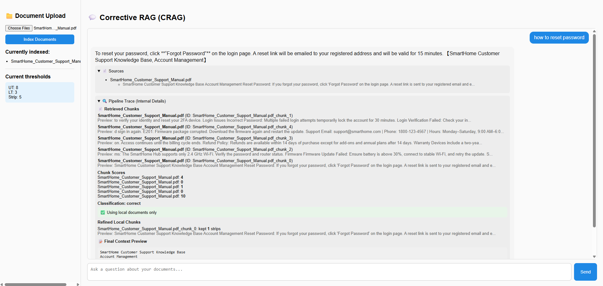

#  Corrective RAG (CRAG) Chatbot for Document Question Answering

[](https://python.org)
[](https://fastapi.tiangolo.com/)
[](https://react.dev/)
[](https://www.pinecone.io/)
[](https://render.com/)
[](https://vercel.com/)

A document question-answering application built using the **Corrective Retrieval-Augmented Generation (CRAG)** approach.

Upload your own documents, ask questions in natural language, and receive accurate, context-aware answers. Instead of relying only on retrieved documents, the application evaluates whether the retrieved context is actually useful. If the retrieved information is insufficient, the system automatically rewrites the query, searches the web, and generates a better response.

This significantly reduces hallucinations compared to a traditional RAG pipeline.

---

# 🚀 Features

### 📄 Upload Documents

Upload your own knowledge base in the form of:

- PDF Documents
- Word Documents (.docx)
- Text Files (.txt)

After uploading, the application automatically:

- extracts text
- chunks the documents
- generates vector embeddings
- stores them inside **Pinecone**

---

### 💬 Ask Questions

Ask questions naturally.

The application:

- retrieves relevant document chunks
- evaluates retrieval quality
- improves retrieval if necessary
- generates grounded answers

---

### 🧠 Corrective Retrieval

Unlike traditional RAG systems, retrieved documents are **not trusted immediately**.

Each retrieved document is evaluated using an LLM and classified as:

- ✅ Correct
- ⚠️ Ambiguous
- ❌ Incorrect

Depending on the evaluation score, the system either:

- answers directly,
- rewrites the query,
- or performs a web search.

---

### 🌍 Web Search Fallback

Whenever the uploaded documents cannot confidently answer a question, the application automatically:

- rewrites the query
- searches the web using Tavily
- retrieves relevant web content
- merges document and web context
- generates the final answer

---

### ⚡ Modern Full-Stack Application

- FastAPI Backend
- React Frontend
- Pinecone Vector Database
- Render Deployment
- Vercel Deployment

---

# 🏗️ Architecture


The architecture consists of four major stages:

- Document Processing
- Retrieval & Evaluation
- Corrective Retrieval
- Answer Generation

---

# 🔄 Workflow


The workflow is implemented using **LangGraph**.

It follows these steps:

1. Retrieve relevant documents.
2. Evaluate every retrieved document.
3. Decide whether retrieval is sufficient.
4. Rewrite the query if required.
5. Search the web when local documents are insufficient.
6. Refine retrieved information.
7. Generate the final answer.

---

# 💻 Application Preview



The interface allows users to:

- Upload documents
- Index them into Pinecone
- Ask natural language questions
- View retrieved sources
- Inspect pipeline traces
- See retrieved chunks
- Understand document evaluation
- View the final generated context

---

# ⚙️ How It Works

The application follows a multi-stage CRAG pipeline.

### 1. Upload Documents

Users upload PDF, DOCX or TXT files.

↓

### 2. Document Processing

Documents are cleaned, chunked and converted into vector embeddings.

↓

### 3. Store Embeddings

Embeddings are stored inside **Pinecone**.

↓

### 4. Semantic Retrieval

Relevant document chunks are retrieved.

↓

### 5. Retrieval Evaluation

Every retrieved document is scored using **Llama 3.1 8B**.

↓

### 6. Corrective Retrieval

Depending on the evaluation:

- Continue with retrieved documents
- Rewrite the query
- Perform web search
- Merge retrieved context

↓

### 7. Answer Generation

The final context is sent to **Qwen3-32B**, which generates the final answer.

---

# 🛠 Tech Stack

## Backend

- FastAPI
- LangChain
- LangGraph
- Python

## AI Models

- all-MiniLM-L6-v2 (Embeddings)
- Llama-3.1-8B (Retrieval Evaluation)
- Qwen3-32B (Answer Generation)

## Vector Database

- Pinecone

## Search Engine

- Tavily Search API

## Frontend

- React
- Vite
- Axios

## Deployment

- Render
- Vercel

---

# 📁 Project Structure

```text
Corrective-RAG
│
├── assets/
├── core/
├── evaluation/
├── generation/
├── indexing/
├── pipeline/
├── processing/
├── react-ui/
├── retrieval/
├── utils/
│
├── api.py
├── app.py
├── requirements.txt
└── README.md
```

---

# 🔮 Future Improvements

- Hybrid Search
- Cross Encoder Re-ranking
- Conversation Memory
- Streaming Responses
- Authentication
- Multi-document Chat
- Source Highlighting
- Response Citations

---

# 👨‍💻 Author

**Anirudh Yadav**

GitHub: https://github.com/ANIRUDH1YADAV
