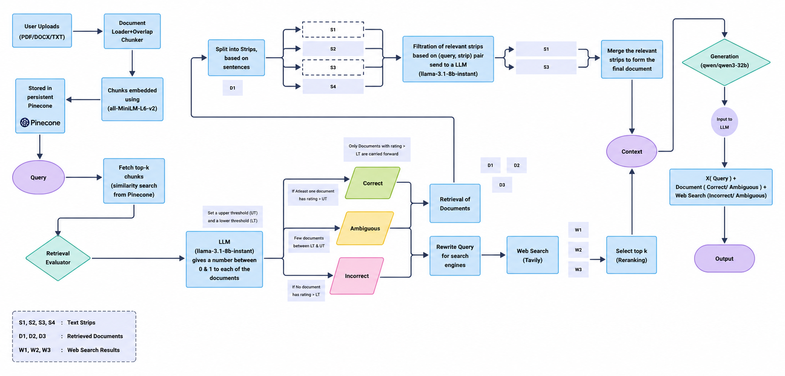

# 🤖 Corrective RAG (CRAG) Chatbot for Document Question Answering

[](https://www.python.org/)
[](https://fastapi.tiangolo.com/)
[](https://react.dev/)
[](https://www.pinecone.io/)
[](https://render.com/)
[](https://vercel.com/)
[](LICENSE)

A web application that allows users to upload documents and ask questions using natural language. The system retrieves the most relevant information from the uploaded documents, evaluates whether the retrieved context is reliable, and automatically performs a web search whenever the document alone cannot provide a confident answer.

Unlike a traditional Retrieval-Augmented Generation (RAG) pipeline, this project follows a **Corrective Retrieval-Augmented Generation (CRAG)** workflow, where retrieved documents are evaluated before answer generation. If the retrieved information is weak or ambiguous, the system rewrites the query, searches the web using Tavily, and combines the most relevant information before generating the final response.

---

# 🚀 Features

### 📄 Upload Your Documents

Upload your own documents and build a searchable knowledge base.

Supported formats:

- PDF (.pdf)
- Microsoft Word (.docx)
- Text Files (.txt)

After uploading:

- Documents are cleaned and processed
- Text is split into semantic chunks
- Chunks are converted into vector embeddings
- Embeddings are stored inside **Pinecone** for semantic retrieval

---

### 💬 Ask Questions

Ask questions in natural language just like chatting with an AI assistant.

The system automatically:

- Retrieves relevant document chunks
- Evaluates retrieval quality
- Improves retrieval if necessary
- Generates context-aware answers

---

### 🧠 Intelligent Retrieval Evaluation

Instead of directly trusting retrieved documents, every retrieved chunk is evaluated by an LLM.

Each retrieved document is classified as:

- ✅ Correct
- ⚠️ Ambiguous
- ❌ Incorrect

This helps reduce hallucinations and improves answer quality.

---

### 🌍 Automatic Web Search

If the uploaded documents do not contain sufficient information, the system automatically:

- Rewrites the user query
- Searches the web using **Tavily**
- Retrieves the most relevant search results
- Combines web information with document context
- Generates a more reliable answer

---

### ⚡ Fast & Scalable

The application is built using a modern full-stack architecture.

- FastAPI Backend
- React Frontend
- Pinecone Vector Database
- Render Deployment
- Vercel Deployment

---

# 🏗️ System Architecture



---

# ⚙️ How It Works

The application follows a multi-stage Corrective RAG pipeline.

### Step 1 — Upload Documents

Users upload PDF, DOCX, or TXT files.

↓

### Step 2 — Document Processing

The uploaded documents are:

- Cleaned
- Chunked into smaller segments
- Converted into vector embeddings

↓

### Step 3 — Store Embeddings

All embeddings are stored inside **Pinecone**, enabling fast semantic similarity search.

↓

### Step 4 — Ask a Question

The user submits a natural language question.

↓

### Step 5 — Retrieve Relevant Documents

The system retrieves the Top-K most relevant document chunks from Pinecone.

↓

### Step 6 — Evaluate Retrieved Documents

Instead of immediately generating an answer, every retrieved document is evaluated using **Llama 3.1 8B**.

Documents are categorized as:

- Correct
- Ambiguous
- Incorrect

↓

### Step 7 — Corrective Retrieval

Depending on the evaluation:

**Correct**

- Continue with retrieved documents.

**Ambiguous**

- Rewrite the query.
- Perform a web search.

**Incorrect**

- Ignore retrieved documents.
- Search the web directly.

↓

### Step 8 — Context Construction

Relevant document chunks and web search results are merged into a single context.

↓

### Step 9 — Answer Generation

The final context is sent to **Qwen3-32B**, which generates the final response.

---

# 💻 Tech Stack

## Backend

- FastAPI
- Python
- LangChain
- Pinecone
- Sentence Transformers
- HuggingFace Embeddings
- Tavily Search API
- Groq API

## Frontend

- React
- Vite
- Axios

## AI Models

- all-MiniLM-L6-v2 (Embeddings)
- Llama 3.1 8B (Retrieval Evaluation)
- Qwen3-32B (Answer Generation)

## Database

- Pinecone Vector Database

## Deployment

- Render
- Vercel

---

# 📂 Project Structure

```text
Corrective-RAG
│
├── assets/
├── core/
├── evaluation/
├── generation/
├── indexing/
├── pipeline/
├── processing/
├── retrieval/
├── utils/
│
├── react-ui/
│
├── api.py
├── app.py
├── requirements.txt
└── README.md
```

---

# 📡 API Endpoints

| Method | Endpoint | Description |
|---------|----------|-------------|
| POST | `/upload` | Upload documents |
| POST | `/query` | Ask questions |
| GET | `/health` | Health check |

---

# 🎯 Future Improvements

- Hybrid Search (Dense + Sparse Retrieval)
- Cross-Encoder Re-ranking
- Streaming Responses
- Conversation Memory
- Authentication
- Multi-document Conversations
- Source Citation Highlighting

---

# 👨‍💻 Author

**Anirudh Yadav**

GitHub: https://github.com/ANIRUDH1YADAV
